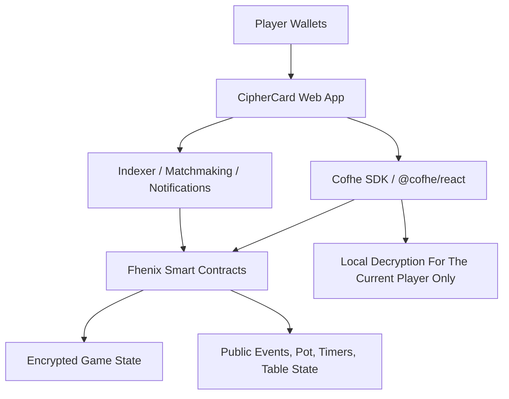

# CipherCard

## Provably Fair Hidden-Hand Card Game on Fhenix

CipherCard is my WaveHack project for the Fhenix Privacy-by-Design Buildathon. I am building a fully on-chain hidden-hand card game where private information actually stays private. Every player's hand is stored as encrypted on-chain state, the game logic runs on encrypted values, and the final result is provably fair without depending on a trusted dealer, casino server, or centralized game operator.

The goal of this project is simple: I want to prove that hidden-information games can finally work on-chain in a way that feels real, fair, and privacy-preserving. Most on-chain games fail the moment secret information matters, because everything becomes public. CipherCard uses FHE on Fhenix to solve that core problem.

## What CipherCard Is

CipherCard is a privacy-first card or poker-style game that lets players:

- join a table directly from their wallet
- receive cards as encrypted on-chain state
- view only their own hand through client-side decryption permissions
- make moves without exposing hidden information to opponents
- settle the game on-chain with provable fairness
- reveal only the information that actually needs to be revealed at showdown

In short, this is a dealerless, privacy-preserving, provably fair card game built for Web3.

## The Problem I Am Solving

Traditional blockchains are transparent by default. That works well for public balances and public rules, but it breaks the moment a game depends on hidden information.

For card games, this creates a major problem:

- if cards are public on-chain, the game is broken
- if game logic is moved off-chain, trust is reintroduced
- if a centralized server deals cards, fairness becomes questionable
- if every losing hand must be revealed, privacy disappears

This is the reason most fully on-chain poker or hidden-hand games have struggled for years. The hidden-information problem has always been the wall.

CipherCard exists to show that FHE changes that.

## My Solution

I am using Fhenix to build a game where hidden game state remains encrypted during gameplay, while the contract still computes on top of that encrypted state.

That means:

- the deck and dealt hands can exist as encrypted values
- hand comparisons and rank evaluation can run on encrypted data
- the contract can determine outcomes without exposing everyone's cards
- only the winner's hand, or the minimum required proof of victory, needs to be revealed at the end

This makes CipherCard a strong example of privacy-by-design architecture instead of privacy added later as a patch.

## Why This Project Matters

I see CipherCard as more than a game demo. I see it as a simple and consumer-friendly proof that FHE can unlock entire product categories that transparent blockchains could not support before.

Why this matters:

- hidden-information games are one of the clearest use cases for encrypted computation
- the UX is easy for people to understand immediately
- the fairness story is powerful because there is no trusted dealer
- it demonstrates real encrypted state, not just private messaging around a public app
- it gives Fhenix a consumer-facing demo that is easy to share, test, and showcase

If this works well, the same design pattern can extend into sealed-bid auctions, private strategy games, confidential PvP mechanics, and other privacy-native applications.

## What The App Actually Does

From a user perspective, CipherCard works like this:

1. A player creates a table and sets game parameters such as buy-in, number of players, and rule set.
2. Other players join the table with their wallets and lock their stake into the game escrow.
3. The game initializes a fair deck generation and shuffle flow without relying on a centralized dealer.
4. Cards are dealt as encrypted values and tied to each player's address.
5. Each player can privately view only their own hand from the frontend through the Fhenix client-side decryption flow.
6. Players take actions such as check, call, raise, fold, or draw depending on the game mode.
7. The contract evaluates the outcome using encrypted comparisons and encrypted card values.
8. At showdown, only the winner's hand or the minimum necessary result is selectively revealed.
9. The pot is settled on-chain automatically and trustlessly.

The important part is that the app does not need a trusted operator to know everyone's cards in order to run the game.

## Core Product Principles

These are the principles I am building CipherCard around:

- Privacy first: hidden information stays hidden by default.
- Fairness first: no dealer, no secret server logic, no manual settlement.
- On-chain truth: the contract is the source of truth for game state and payouts.
- Minimal reveal: only the data required to prove the result gets revealed.
- Consumer-ready UX: the product should feel understandable even for non-technical players.

## The Best Architecture For CipherCard

The best architecture for this app is a hybrid privacy-first architecture:

- on-chain contracts handle game state, escrow, encrypted logic, and final settlement
- client-side Fhenix tooling handles encryption, private viewing, and decrypt permissions
- a thin off-chain service handles indexing, matchmaking, notifications, and cached public state for a smoother UX

I am not using the backend as a trusted authority. It is only a convenience layer. If the off-chain service disappears, the game rules and settlement logic still live on-chain.

This architecture is the right choice because:

- a fully centralized backend would destroy the trust model
- a contracts-only UX would be too slow and too hard to use
- a hybrid design keeps fairness trustless while keeping the app practical

## High-Level Architecture



## Architecture Breakdown

### 1. Smart Contract Layer

The smart contract layer is the heart of the system. This is where trustlessness, encrypted state, and settlement live.

I am structuring the contract layer around these responsibilities:

- `GameFactory`: creates new tables and standardizes game deployments
- `CipherTable`: manages one live table, player seats, turn order, state transitions, and game lifecycle
- `DeckManager`: handles encrypted deck initialization, shuffling inputs, and dealing flow
- `HandEvaluator`: compares encrypted hands and determines the winning outcome
- `EscrowTreasury`: holds player buy-ins and handles automated payouts
- `TimeoutManager`: resolves stalled rounds, rage quits, or inactivity cases safely

For the actual implementation, I am keeping deployment simple. That means I am using one table contract plus reusable libraries instead of splitting every tiny rule into separate deployed contracts. This keeps the architecture cleaner for a buildathon while still leaving room for modularity.

### 2. Frontend Layer

The frontend is where privacy becomes usable.

I am using the frontend to:

- connect wallets
- create and join tables
- request encryption and decryption operations
- render masked cards for opponents
- show the current player's hand privately
- display public game state such as pot, timer, action history, and winner

The frontend is not trusted with game fairness. It only helps players interact with the encrypted contract state in a usable way.

### 3. Off-Chain Service Layer

The off-chain service is intentionally thin and non-authoritative.

I am using it for:

- table discovery and lobby views
- event indexing and game history
- push notifications and turn reminders
- cached reads for faster UI updates
- analytics and replay-friendly public metadata

This layer improves UX, but it never becomes the source of truth for cards, outcomes, or payouts.

## Public Data vs Encrypted Data

One of the most important architecture choices in CipherCard is deciding what should stay public and what should stay encrypted.

### Public State

The following information can remain public:

- table id
- buy-in amount
- player wallet addresses
- turn number
- pot size
- blind structure or game rules
- timeouts and game status
- final winner address

### Encrypted State

The following information should remain encrypted during gameplay:

- deck order
- dealt cards
- player hands
- hand strength values
- showdown comparison data before resolution

### Selectively Revealed State

At the end of the game, I only want to reveal what is necessary:

- winning hand
- winning combination
- final proof of why that hand won

Losing hands do not need to become fully public if the game can still prove the outcome correctly.

## How Fairness Works Without A Dealer

This is the part that makes the project interesting.

I do not want a centralized server to shuffle and distribute cards. Instead, the fairness model is based on a dealerless flow:

1. Players commit to randomness inputs before the hand starts.
2. The contract combines those commitments with chain entropy or protocol-supported randomness.
3. The resulting randomness is used to derive the shuffle path.
4. The deck and dealt cards are stored in encrypted form on-chain.
5. Each player receives only the ability to privately view their own hand.
6. The contract computes the result from encrypted state instead of trusting a human dealer.

This makes the game much harder to cheat because no single party controls the deck or the result.

## How Private Viewing Works

CipherCard is not about hiding information from the actual card owner. A player still needs to see their own hand.

So the privacy model works like this:

- the contract stores the hand as encrypted state
- the frontend uses Fhenix client tooling to request a permitted local decryption flow
- the player can view their own cards in the UI
- opponents, spectators, and public chain observers cannot read that hand

This gives me the best of both worlds: usable gameplay and preserved confidentiality.

## Game Flow In Detail

### Phase 1: Table Creation

A player creates a table, chooses the rule set, sets the stake, and opens the game for other players.

### Phase 2: Player Join And Escrow

Players join the table, lock their buy-in, and confirm readiness. The table cannot begin until the minimum number of players is reached.

### Phase 3: Randomness Commit And Encrypted Deal

Each player contributes a randomness commitment. The contract finalizes the shuffle source, builds the deck, and deals encrypted cards to each participant.

### Phase 4: Private Play

Each player can privately inspect their own hand while all public viewers only see masked cards. Gameplay actions progress on-chain according to the rules of the table.

### Phase 5: Encrypted Evaluation

When the hand reaches showdown, the contract compares encrypted card values and calculates the winner without exposing every player's hand during the evaluation process.

### Phase 6: Selective Reveal And Settlement

The winner's result is revealed, the contract settles the pot, and the final game summary is stored for history and replay.

## Tech Stack I Am Using

I am designing CipherCard around the Fhenix ecosystem and a modern TypeScript monorepo stack.

### Blockchain And Privacy Stack

- Fhenix encrypted smart contract architecture
- Solidity for contract development
- CoFHE SDK for encryption and decryption flows
- `@cofhe/react` hooks for frontend integration
- Hardhat for local development, testing, and deployments

### Frontend Stack

- Next.js
- React
- TypeScript
- wagmi or viem for wallet and contract interactions
- Tailwind CSS for fast UI development

### Off-Chain Support Stack

- Node.js and TypeScript
- Postgres for indexed game metadata
- Redis for lightweight ephemeral table presence or queueing
- event listeners / indexer workers for contract events

## Repo Structure

To keep the project clean and scalable, I am structuring the codebase like this:

```text
waveahk3/
  README.md
  apps/
    web/
  packages/
    contracts/
    shared/
    ui/
  services/
    indexer/
  docs/
```

### What Each Part Does

- `apps/web`: the actual game client players use
- `packages/contracts`: Solidity contracts, tests, deployment scripts, and encrypted game logic
- `packages/shared`: shared ABIs, generated types, game enums, constants, and helper utilities
- `packages/ui`: reusable components for cards, tables, status panels, and wallet-driven game actions
- `services/indexer`: reads chain events and powers lobby views, history, notifications, and public replays
- `docs`: architecture notes, threat model, and protocol design

This structure keeps frontend, contract logic, and shared types organized without making the project unnecessarily complicated.

## Why This Architecture Is Strong For WaveHack

CipherCard fits the WaveHack and Fhenix buildathon theme very well because it directly demonstrates:

- privacy-by-design instead of retrofitted privacy
- encrypted state as a core primitive
- real smart contract computation on confidential data
- selective disclosure instead of full transparency
- a consumer-facing use case that is easy to understand and demo

This is not just a privacy wrapper around a normal app. Privacy is the product itself.

## MVP Scope

For the hackathon version, I want the MVP to stay focused and strong.

My MVP scope is:

- one simple hidden-hand card mode or simplified poker-style mode
- 2 to 4 players
- encrypted dealing
- private hand viewing
- basic actions
- provable winner resolution
- on-chain settlement

I am focusing on building one mode extremely well instead of overpromising a full casino product too early.

## Future Expansion

Once the core loop is working, CipherCard can expand into:

- full poker variants
- tournaments and ranked tables
- private spectator modes with delayed reveal
- NFT-based table themes and player identities
- cross-game encrypted inventory or reputation systems
- confidential wagering with stablecoins

The important thing is that the core privacy architecture stays the same even as the game grows.

## Risks And How I Am Thinking About Them

This project has real technical challenges, so I want to be honest about them.

### 1. Randomness And Shuffle Fairness

If randomness is weak, the game is weak. I need a fair shuffle flow that no single participant can control.

### 2. UX Complexity

FHE-powered apps can feel confusing if encryption and decryption are visible as technical steps. I need the UI to make privacy feel natural, not intimidating.

### 3. Gas And Latency

Encrypted computation is more expensive than normal state updates, so I need to design the game loop carefully and keep the first version compact.

### 4. Timeouts And Griefing

Any turn-based game can be stalled by inactive players. I need clean timeout logic and safe settlement paths.

These challenges are exactly why I am keeping the architecture modular and the MVP focused.

## Why I Am Building This

I am building CipherCard because it captures the value of FHE in a way that people can feel instantly. Instead of explaining encrypted computation in abstract terms, I can show a game where hidden cards stay hidden, the winner is still provable, and nobody has to trust a dealer.

That is a strong story for users, judges, developers, and the wider Fhenix ecosystem.

## Final Summary

CipherCard is my privacy-native hidden-hand game built on Fhenix. It uses encrypted on-chain state, private per-player views, encrypted outcome evaluation, and selective reveal to make dealerless card gameplay possible on-chain. The architecture I am using is intentionally balanced: trustless where fairness matters, lightweight where UX matters, and modular enough to grow beyond the first WaveHack version.

If I execute this well, CipherCard becomes both a playable product and a clear demonstration of why privacy-by-design is the future of on-chain applications.
